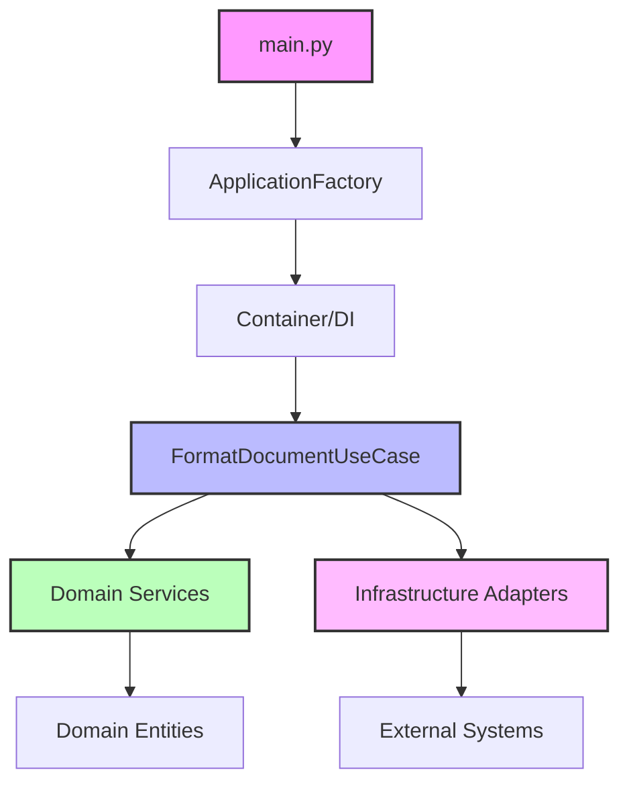

# Clean Architecture Implementation

## 🎯 Overview

This application demonstrates a production-ready implementation of Clean Architecture (also known as Hexagonal Architecture or Ports & Adapters pattern) in Python. The architecture ensures maintainable, testable, and scalable code through strict separation of concerns and dependency inversion.

## 🏛️ Architecture Principles

### Core Principles
1. **Independence of Frameworks**: Business logic doesn't depend on external libraries
2. **Testability**: Business logic can be tested without UI, database, or external services
3. **Independence of UI**: Business logic doesn't know about presentation details
4. **Independence of Database**: Business rules don't depend on database specifics
5. **Independence of External Services**: Core logic is isolated from external APIs

### The Dependency Rule
Dependencies point inward. Inner layers know nothing about outer layers:
- Domain → knows nothing about Application, Infrastructure
- Application → knows Domain, nothing about Infrastructure
- Infrastructure → knows Domain and Application

## 📁 Layer Architecture

### 1. Domain Layer (`src/domain/`)
The heart of the application containing pure business logic.

#### Components:
- **`entities.py`**: Core business objects
  - `Document`: Represents a text document to be processed
  - `ProcessedChunk`: A processed piece of text with metadata
  - `ProcessingSession`: Tracks a complete processing session
  - `FormattingContext`: Maintains context across processing

- **`services.py`**: Domain services with business rules
  - `TextChunkingService`: Splits large texts intelligently
  - `PromptBuilder`: Constructs prompts with context
  - `PromptContinuityService`: Manages prompt continuity

- **`value_objects.py`**: Immutable value objects
  - `ChunkMetadata`: Metadata for text chunks
  - `ProcessingStatus`: Enum for processing states
  - `ErrorCode`: Domain-specific error codes

- **`constants.py`**: Domain constants and configuration

#### Characteristics:
- ✅ No external dependencies
- ✅ Pure Python code
- ✅ Contains all business rules
- ✅ Fully unit testable

### 2. Application Layer (`src/application/`)
Orchestrates the flow of data and coordinates domain objects.

#### Components:
- **`ports.py`**: Abstract interfaces (Ports)
  ```python
  class TextProcessorPort(ABC):
      """Interface for text processing services"""
      @abstractmethod
      def process_text(self, prompt: str, text: str) -> ProcessingResult:
          pass
  
  class StoragePort(ABC):
      """Interface for storage services"""
      @abstractmethod
      def save(self, key: str, data: Any) -> None:
          pass
  ```

- **`use_cases.py`**: Application use cases
  - `FormatDocumentUseCase`: Main use case for document formatting
  - Orchestrates domain services and infrastructure

- **`services.py`**: Application-level services
  - Cross-cutting concerns
  - Use case coordination

#### Characteristics:
- ✅ Defines interfaces for external services
- ✅ Contains application-specific business rules
- ✅ Orchestrates domain objects
- ✅ No knowledge of implementation details

### 3. Infrastructure Layer (`src/infrastructure/`)
Implements all external interfaces and provides concrete implementations.

#### Components:
- **`adapters.py`**: Concrete implementations
  - `OpenAIAdapter`: Implements TextProcessorPort for OpenAI
  - `FileSystemAdapter`: Implements StoragePort for file system
  - `JsonContextAdapter`: Implements ContextPort for JSON storage

- **`dependency_injection.py`**: DI container
  ```python
  class ApplicationFactory:
      """Factory for creating configured application instances"""
      
      @staticmethod
      def create_default() -> FormatDocumentUseCase:
          """Create use case with default configuration"""
          return Container().get_use_case()
  ```

- **`exceptions.py`**: Infrastructure exceptions
  - `ApplicationError`: Base exception with error codes
  - `OpenAIError`: API-specific errors
  - `StorageError`: File system errors

#### Characteristics:
- ✅ Implements all abstract ports
- ✅ Handles external communications
- ✅ Contains framework-specific code
- ✅ Easily replaceable implementations

## 🔄 Data Flow



### Request Flow Example:
1. **Entry Point** (`main.py`): Receives user request
2. **DI Container**: Creates and wires dependencies
3. **Use Case**: Orchestrates the business flow
4. **Domain Services**: Apply business rules
5. **Adapters**: Communicate with external services
6. **Response**: Returns processed result

## 🎨 Design Patterns Used

### 1. Ports and Adapters (Hexagonal Architecture)
```python
# Port (Abstract Interface)
class TextProcessorPort(ABC):
    @abstractmethod
    def process_text(self, prompt: str, text: str) -> ProcessingResult:
        pass

# Adapter (Concrete Implementation)
class OpenAIAdapter(TextProcessorPort):
    def process_text(self, prompt: str, text: str) -> ProcessingResult:
        # OpenAI-specific implementation
        response = self.client.chat.completions.create(...)
        return ProcessingResult(...)
```

### 2. Dependency Injection
```python
class Container:
    def __init__(self):
        self._instances = {}
        self._factories = {
            'text_processor': lambda: OpenAIAdapter(...),
            'storage': lambda: FileSystemAdapter(...),
        }
    
    def get(self, name: str):
        if name not in self._instances:
            self._instances[name] = self._factories[name]()
        return self._instances[name]
```

### 3. Factory Pattern
```python
class ApplicationFactory:
    @staticmethod
    def create_default() -> FormatDocumentUseCase:
        container = Container()
        return FormatDocumentUseCase(
            text_processor=container.get('text_processor'),
            storage=container.get('storage'),
            chunking_service=TextChunkingService()
        )
```

### 4. Strategy Pattern
Different text processing strategies can be swapped:
```python
# Easy to switch between different AI providers
container.register('text_processor', AnthropicAdapter())  # or
container.register('text_processor', OpenAIAdapter())     # or
container.register('text_processor', LocalLLMAdapter())
```

## 🧪 Testing Strategy

### 1. Unit Tests
Test each component in isolation:
```python
def test_text_chunking_service():
    service = TextChunkingService(max_chunk_size=100)
    chunks = service.split_text("long text...")
    assert len(chunks) > 0
    assert all(len(c.text) <= 100 for c in chunks)
```

### 2. Integration Tests
Test component interactions:
```python
def test_format_document_use_case():
    mock_processor = Mock(spec=TextProcessorPort)
    mock_storage = Mock(spec=StoragePort)
    
    use_case = FormatDocumentUseCase(
        text_processor=mock_processor,
        storage=mock_storage
    )
    
    result = use_case.execute()
    mock_processor.process_text.assert_called()
    mock_storage.save.assert_called()
```

### 3. Test Doubles
Use mocks, stubs, and fakes:
```python
class FakeOpenAIAdapter(TextProcessorPort):
    def process_text(self, prompt: str, text: str) -> ProcessingResult:
        return ProcessingResult(
            text="Fake processed text",
            metadata={"test": True}
        )
```

## 🚀 Benefits of This Architecture

### 1. **Testability**
- Domain logic tested without external dependencies
- Easy to create test doubles for ports
- Fast unit tests without I/O operations

### 2. **Maintainability**
- Clear separation of concerns
- Single responsibility for each component
- Easy to locate and fix bugs

### 3. **Flexibility**
- Swap implementations without changing business logic
- Add new features without modifying existing code
- Support multiple storage backends or AI providers

### 4. **Scalability**
- Easy to add new use cases
- Modular structure supports team development
- Clear boundaries prevent coupling

### 5. **Documentation**
- Architecture serves as living documentation
- Clear interfaces document contracts
- Use cases document business flows

## 🔧 Extending the Architecture

### Adding a New AI Provider
1. Create new adapter implementing `TextProcessorPort`:
```python
class AnthropicAdapter(TextProcessorPort):
    def process_text(self, prompt: str, text: str) -> ProcessingResult:
        # Anthropic-specific implementation
        pass
```

2. Register in DI container:
```python
container.register('text_processor', AnthropicAdapter())
```

### Adding a New Storage Backend
1. Create adapter implementing `StoragePort`:
```python
class S3Adapter(StoragePort):
    def save(self, key: str, data: Any) -> None:
        # S3-specific implementation
        pass
```

2. Wire in container:
```python
container.register('storage', S3Adapter())
```

### Adding a New Use Case
1. Define the use case:
```python
class SummarizeDocumentUseCase:
    def __init__(self, text_processor: TextProcessorPort):
        self.text_processor = text_processor
    
    def execute(self, document: Document) -> Summary:
        # Use case logic
        pass
```

2. Register in factory:
```python
@staticmethod
def create_summarizer() -> SummarizeDocumentUseCase:
    container = Container()
    return SummarizeDocumentUseCase(
        text_processor=container.get('text_processor')
    )
```

## 📊 Metrics and Monitoring

### Code Quality Metrics
- **Coupling**: Low coupling between layers
- **Cohesion**: High cohesion within modules
- **Complexity**: Cyclomatic complexity < 10 per method
- **Coverage**: > 90% test coverage for domain layer

### Architecture Fitness Functions
Tests that validate architectural rules:
```python
def test_domain_has_no_external_dependencies():
    """Domain layer should not import from infrastructure"""
    domain_imports = analyze_imports('src/domain')
    assert 'infrastructure' not in domain_imports
    assert 'openai' not in domain_imports
```

## 🎓 Learning Resources

### Books
- "Clean Architecture" by Robert C. Martin
- "Domain-Driven Design" by Eric Evans
- "Implementing Domain-Driven Design" by Vaughn Vernon

### Articles
- [The Clean Architecture](https://blog.cleancoder.com/uncle-bob/2012/08/13/the-clean-architecture.html)
- [Hexagonal Architecture](https://alistair.cockburn.us/hexagonal-architecture/)
- [DDD in Python](https://github.com/pgorecki/python-ddd)

### Example Projects
- [Python Clean Architecture](https://github.com/Enforcer/clean-architecture-python)
- [Hexagonal Architecture Python](https://github.com/iktakahiro/dddpy)

## 🔮 Future Enhancements

### Short Term
- [ ] Add caching layer for API responses
- [ ] Implement retry mechanism with exponential backoff
- [ ] Add request/response logging
- [ ] Create health check endpoints

### Medium Term
- [ ] Implement event sourcing for audit trail
- [ ] Add CQRS for read/write separation
- [ ] Create REST API layer
- [ ] Add WebSocket support for streaming

### Long Term
- [ ] Microservices architecture
- [ ] Kubernetes deployment
- [ ] GraphQL API
- [ ] Multi-tenant support